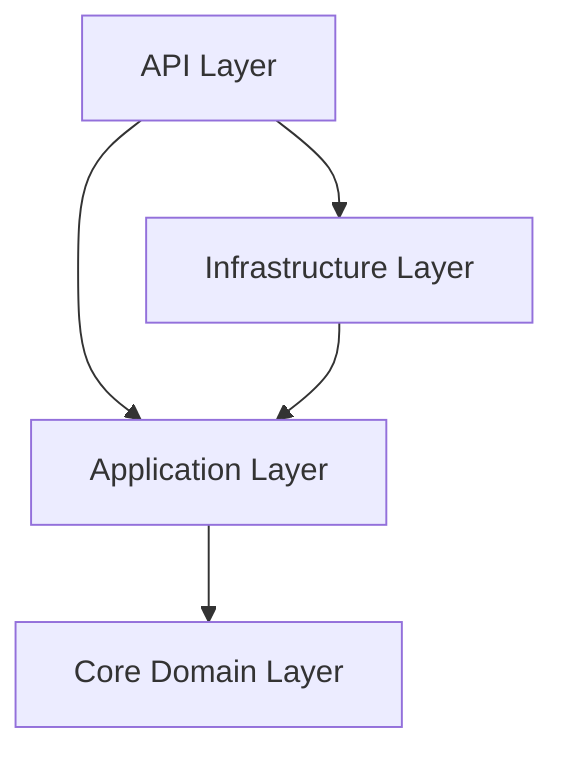

# WebShop API - Product Requirements Document

## 1. Project Overview

### 1.1 Introduction
The WebShop API is a RESTful service that provides core e-commerce functionality including user management, product catalog, and shopping basket features. This API will serve as the backend for a web-based shopping platform.

### 1.2 Objectives
- Implement a secure user authentication system
- Provide product catalog management capabilities
- Enable shopping basket functionality for users
- Follow REST best practices and Onion Architecture principles

## 2. System Architecture

### 2.1 Architecture Overview
The system follows the Onion Architecture pattern with four main layers:



#### 2.1.1 Core Domain Layer (MyApp.Core)
- Contains domain entities (User, Product, Basket)
- Defines interfaces for repositories
- Houses core business logic and domain services

#### 2.1.2 Application Layer (MyApp.Application)
- Implements use cases and business workflows
- Contains DTOs and mapping logic
- Defines service interfaces

#### 2.1.3 Infrastructure Layer (MyApp.Infrastructure)
- Implements data persistence
- Handles external service integration
- Provides concrete implementations of interfaces

#### 2.1.4 API Layer (MyApp.API)
- Exposes REST endpoints
- Handles HTTP concerns
- Manages authentication/authorization

## 3. Detailed Requirements

### 3.1 User Management
#### 3.1.1 User Registration
- Accept user registration with username, email, and password
- Validate email format and password strength
- Ensure username uniqueness
- Return created user details (excluding password)

#### 3.1.2 User Authentication
- Implement JWT-based authentication
- Accept username/password login credentials
- Return JWT token upon successful authentication
- Include appropriate security headers

### 3.2 Product Management
#### 3.2.1 Product Listing
- Support pagination of product lists
- Allow filtering by category
- Return product details including availability
- Sort products by relevant criteria

#### 3.2.2 Product Operations
- Enable CRUD operations for products
- Implement partial updates using ProductUpdate model
- Validate price and availability updates
- Ensure proper authorization for admin operations

### 3.3 Shopping Basket
#### 3.3.1 Basket Management
- Maintain user-specific shopping baskets
- Calculate total price automatically
- Support add/remove operations for items
- Validate product availability when adding items

## 4. Data Models

### 4.1 User Models
```typescript
User {
    id: string
    username: string
    email: string
    createdAt: string
}

UserRegistration {
    username: string
    email: string
    password: string
}

UserLogin {
    username: string
    password: string
}
```

### 4.2 Product Models
```typescript
Product {
    id: string
    name: string
    description: string
    price: float32
    available: boolean
    category: string
}

ProductUpdate {
    name?: string
    description?: string
    price?: float32
    available?: boolean
    category?: string
}
```

### 4.3 Basket Models
```typescript
Basket {
    userId: string
    items: BasketItem[]
    total: float32
}

BasketItem {
    productId: string
    quantity: int32
}
```

## 5. API Endpoints

### 5.1 User Service
- POST /users - Create new user
- GET /users/{userId} - Retrieve user details

### 5.2 Auth Service
- POST /auth/login - Authenticate user

### 5.3 Product Service
- GET /products - List products with filtering
- GET /products/{productId} - Get product details
- PUT /products/{productId} - Update product
- DELETE /products/{productId} - Delete product

### 5.4 Basket Service
- GET /basket - Get user's basket
- POST /basket - Add item to basket
- DELETE /basket/{itemId} - Remove item from basket

## 6. Security Considerations

### 6.1 Authentication & Authorization
- Implement JWT token-based authentication
- Secure admin endpoints with appropriate roles
- Apply HTTPS for all communications
- Implement rate limiting

### 6.2 Data Protection
- Hash passwords using strong algorithms
- Validate all input data
- Implement proper error handling
- Follow OWASP security guidelines

## 7. Implementation Guidelines

### 7.1 Development Standards
- Follow C# coding conventions
- Implement comprehensive unit tests
- Use dependency injection
- Document public APIs using XML comments

### 7.2 Error Handling
- Implement global exception handling
- Return appropriate HTTP status codes
- Provide meaningful error messages
- Log errors appropriately

### 7.3 Performance Considerations
- Implement caching where appropriate
- Optimize database queries
- Use async/await for I/O operations
- Consider pagination for large datasets

## 8. Testing Requirements

### 8.1 Unit Testing
- Test all business logic components
- Implement mocking for external dependencies
- Achieve high code coverage
- Follow AAA pattern in tests

### 8.2 Integration Testing
- Test API endpoints
- Verify database operations
- Test authentication flows
- Validate error scenarios

## 9. Deployment Considerations

### 9.1 Environment Setup
- Configure development environment
- Set up staging environment
- Prepare production environment
- Manage configuration per environment

### 9.2 Monitoring
- Implement health checks
- Set up logging
- Configure monitoring alerts
- Track performance metrics