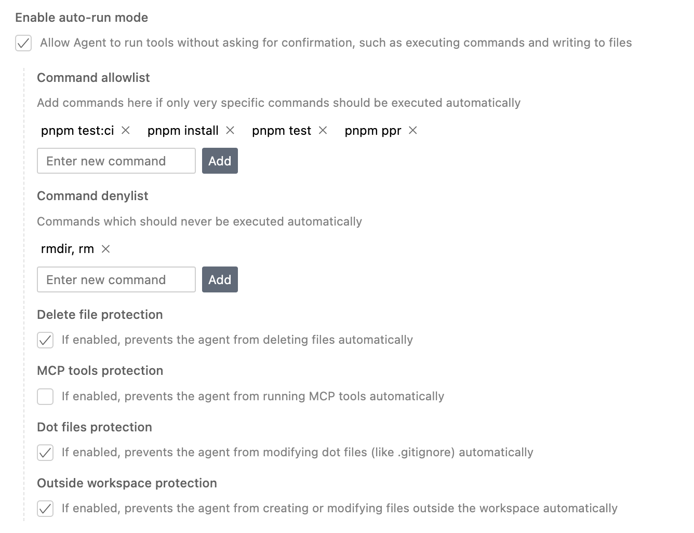
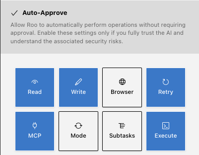

# Test Driven AI Development (TDAID)

Let's say we want to create a function that converts a Markdown string into its HTML equivalent. A basic approach might involve using a simple prompt like this:

```prompt
Create a function that converts a markdown string to a html string
```

While the AI can generate a function from a simple prompt, it often falls short of creating production-ready code. We still need to manually write unit tests and validate the results. Let's explore how to improve this process by incorporating a test-driven development approach.

## Auto Run

First give the AI the right to auto-run tools (use at your own risk)

### Cursor



### RooCode



### GitHub Copilot

Copilot doesn't have this option. There is a human intervention to confirm actions.


## Improve the prompt

And now, the better prompt that improves your results. Let the AI write the tests first, then the code, and finally run the tests.

```prompt
Create a function that converts a markdown string to an html string. Write the tests first, then the code, then run the tests and update the code until the tests pass.
```

## Self heal

Sometimes, after an AI modification, linting or type errors may arise. To address these, use the following prompt to automatically resolve these issues.

```
I've got some lint, build test errors, run `node run ppr` to see the errors, then fix them, and run the ppr again util ppr passes.
```